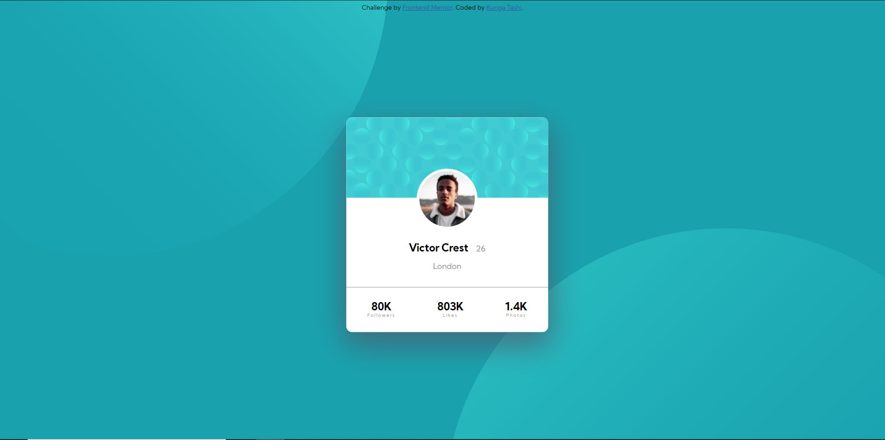

# Frontend Mentor - Profile card component solution

This is a solution to the [Profile card component challenge on Frontend Mentor](https://www.frontendmentor.io/challenges/profile-card-component-cfArpWshJ).

## Table of contents

- [Overview](#overview)
  - [The challenge](#the-challenge)
  - [Screenshot](#screenshot)
  - [Links](#links)
- [My process](#my-process)
  - [Built with](#built-with)
  - [What I learned](#what-i-learned)
- [Author](#author)

## Overview

### The challenge

- This is an insta like profile card

### Screenshot

;

This is the desktop version, the mobile version is in process.

## My process

### Built with

- Semantic HTML5 markup
- CSS custom properties
- Flexbox

### What I learned

- Learned that it was possible to use two images in background, how to position background images, shape outside, various media queries etc.

```css
background: url("/images/bg-pattern-top.svg"),
  url("/images/bg-pattern-bottom.svg"), var(--dark-cyan);
background-position: -19.7916667vw -69.5833333vh, 50.1388889vw 51.8055556vh;
```

### Continued development

Currently I need to focus more on layouts, positioning, grids etcetera.

## Author

- Website - [Kunga Tashi](https://kuntash.github.io/Personal_Website/)
- Frontend Mentor - [@Kuntash](https://www.frontendmentor.io/profile/Kuntash)
- Twitter - [@KuntashTweets](https://www.twitter.com/KuntashTweets)
